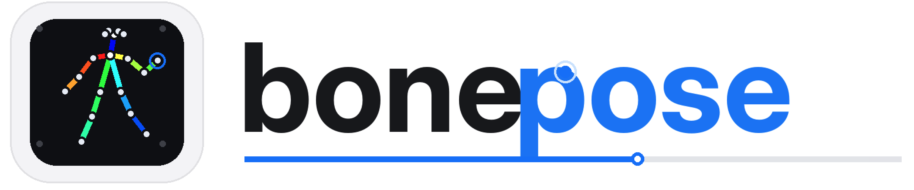
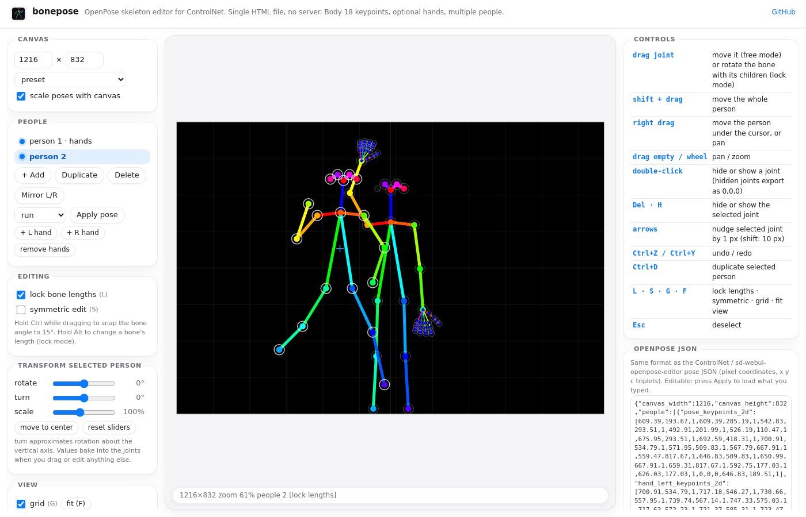
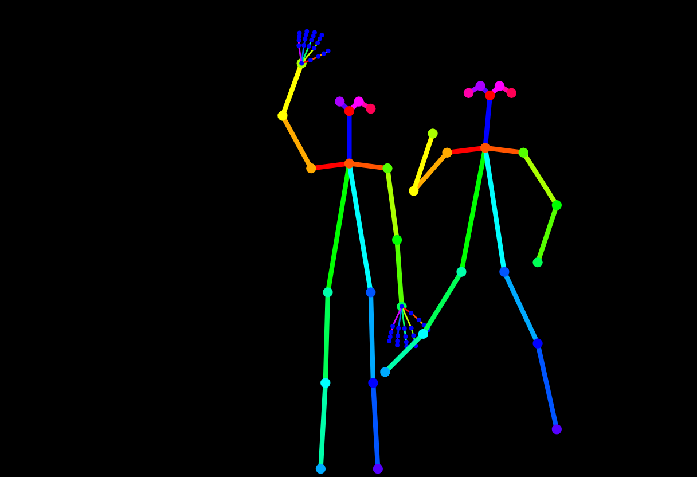
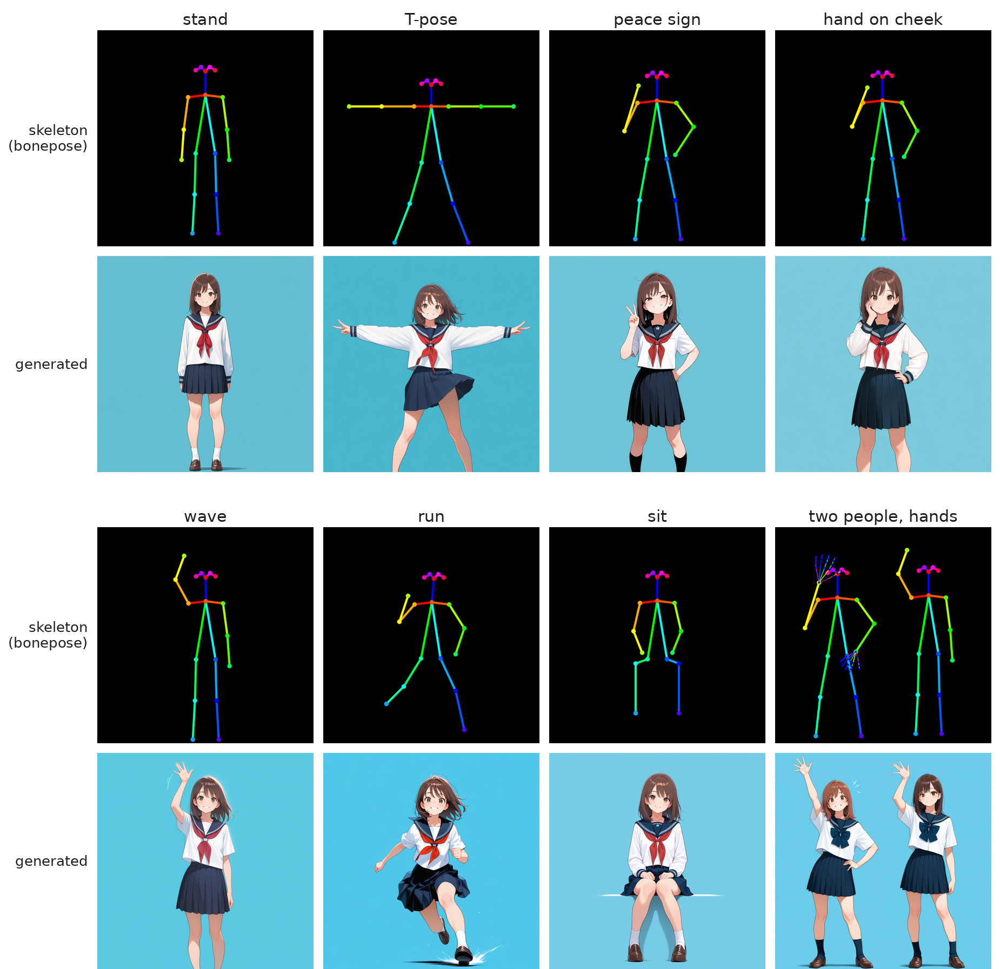

<p align="center"></p>

OpenPose skeleton editor in a single HTML file. It draws the 18-keypoint OpenPose skeleton for ControlNet. No server, no build step, no dependencies. Open `index.html` in a browser (or use the hosted copy) and drag the joints.

**Live:** https://hisashi-ito.github.io/bonepose/ · [日本語](README_ja.md)



The exported PNG is exactly what an OpenPose ControlNet expects as its hint image: a black background with the standard 18-colour limb palette. It was built for the [Draw Things CLI `--pose-image` fork](https://github.com/hisashi-ito/draw-things-community), but it works with any OpenPose ControlNet (A1111, ComfyUI, Forge, Draw Things).





Top rows: skeletons drawn in bonepose (presets, one with both hands added). Bottom rows: images generated from those skeletons with WAI-illustrious-SDXL v16 and the xinsir OpenPose SDXL ControlNet through diffusers on an RTX 4080 (1024 × 1024, 25 steps, CFG 6, Euler a, seed 777, ControlNet weight 1.0 for the first 60 % of the steps; prompt "masterpiece, best quality, amazing quality, 1girl, solo, medium hair, brown hair, brown eyes, serafuku, school uniform, <pose tags>, smile, looking at viewer, full body, light blue background"). The same skeleton PNGs work unchanged in Draw Things, A1111, Forge and ComfyUI. The script is `examples/generate_with_diffusers.py`.

## Features

The feature set was taken from the editors people already use inside A1111 and ComfyUI, and reduced to what fits in one file.

| Feature | Details |
|---|---|
| Multiple people | add, duplicate, delete, mirror left/right, right-drag to move one person |
| Lock bone lengths | drag a joint and the bone rotates about its parent, children follow (forward kinematics). Alt changes the length, Ctrl snaps the angle to 15°, dragging the neck moves the whole person |
| Symmetric edit | the mirrored joint follows across the body axis |
| Hands | optional 21-keypoint OpenPose hands attached to the wrists, drawn in the OpenPose hand palette |
| Hidden joints | double-click or press Delete; hidden joints are written as `0,0,0` and the attached limbs are not drawn |
| Whole-person transforms | rotate, turn (approximate rotation about the vertical axis), scale |
| Reference image | trace over a photo with adjustable opacity; never included in the export |
| Undo / redo | Ctrl+Z, Ctrl+Y, up to 200 steps |
| Canvas size | any size, with presets for common SDXL resolutions; poses scale with the canvas |
| OpenPose JSON | import and export the same JSON as ControlNet and sd-webui-openpose-editor (`people[].pose_keypoints_2d` as `x, y, c` triplets, `canvas_width`, `canvas_height`); face keypoints are kept and drawn |
| PNG | download, or copy to the clipboard |
| Library | save pose sets in the browser (localStorage) |
| Presets | stand, T-pose, peace, cheek, arms up, wave, walk, run, sit |

## Controls

| Input | Action |
|---|---|
| drag joint | move it (free mode) or rotate the bone with its children (lock mode) |
| Shift + drag | move the whole person |
| right drag | move the person under the cursor, or pan |
| drag empty / wheel | pan / zoom |
| double-click | hide or show a joint |
| Del · H | hide or show the selected joint |
| arrows | nudge the selected joint by 1 px (Shift: 10 px) |
| Ctrl+Z / Ctrl+Y | undo / redo |
| Ctrl+D | duplicate the selected person |
| L · S · G · F | lock lengths · symmetric · grid · fit view |
| Esc | deselect |

## Keypoint convention

Index order is the OpenPose COCO-18 layout: 0 nose, 1 neck, 2–4 right shoulder/elbow/wrist, 5–7 left shoulder/elbow/wrist, 8–10 right hip/knee/ankle, 11–13 left hip/knee/ankle, 14 right eye, 15 left eye, 16 right ear, 17 left ear. "Right" is the subject's right, which is on the left of the image when the subject faces the viewer. Limb colours follow the standard 18-colour palette used by the ControlNet OpenPose preprocessor.

## Using the output

Draw Things CLI (fork with `--pose-image`):

```
draw-things-cli generate --model <sdxl_model>.ckpt --pose-image openpose_1024x1024.png \
  --config-json '{"controls":[{"file":"openpose_sdxl_xinsir_ctrl_f16.ckpt","weight":1.0,"guidanceStart":0,"guidanceEnd":0.6,"inputOverride":"pose"}]}' \
  --prompt "..." --output out.png
```

A1111 / Forge: ControlNet unit → upload the PNG, preprocessor `none`, model `openpose`.
ComfyUI: load the PNG with `LoadImage` and feed it to `Apply ControlNet` with an OpenPose model; no preprocessor.

## Embedding

The page exposes a tiny API on `window.openposeEditor`: `toJSON()`, `fromJSON(obj)`, `renderPNG()` (returns a canvas), `state`, `view`, `undo()`, `redo()`. That is enough to drop the file into an iframe and pull the pose out.

## Tests

`tests/test.js` drives the editor with synthetic pointer and keyboard events and checks 28 behaviours (bone-length lock, snapping, symmetric edit, hands following the wrist, undo/redo, JSON round trip, PNG export size). Run them headlessly with:

```
tests/run.sh
```

It uses the Chromium bundled in the `minlag/mermaid-cli` docker image if no local `chromium` is found.

## Acknowledgements

The feature list was informed by [sd-webui-openpose-editor](https://github.com/huchenlei/sd-webui-openpose-editor), [openpose-editor](https://github.com/fkunn1326/openpose-editor), [comfyui-openpose-studio](https://github.com/oosawak/comfyui-openpose-studio) and [Posex](https://github.com/hnmr293/posex). No code is shared with them.

## License

MIT
